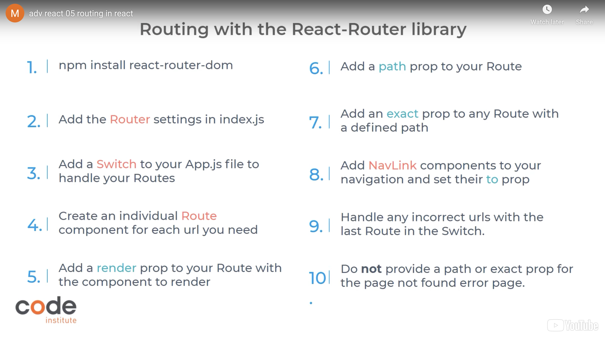

# Getting started with React

## Bootstrap-React

1. npm install react-bootstrap bootstrap@4.6.0

2. Then

<link
  rel="stylesheet"
  href="https://cdn.jsdelivr.net/npm/bootstrap@4.6.0/dist/css/bootstrap.min.css"
  integrity="sha384-B0vP5xmATw1+K9KRQjQERJvTumQW0nPEzvF6L/Z6nronJ3oUOFUFpCjEUQouq2+l"
  crossorigin="anonymous"
/>

in the head of index.html

3. Then create folder "components" and "assets" in "src"

## CSS styling

1. Add google fonts in the head

<link href="https://fonts.googleapis.com/css2?family=DM+Sans:wght@500;700&display=swap" rel="stylesheet" />

2. Inside "src" folder, remove the App.css file
3. Add App.module.css instead in the same folder.

Inside App.module.css:

let’s set a class name for .App, and give it a font-family property of “DM Sans”, which is the font we just imported, and a backup of sans-serif. As our App component will hold all of our content, we’ll use this same class to set a background-color of #f8f8f8 and a minimum height of 100vh.

4. Import it to App.js

import styles from "./App.module.css";

5. Then for the rest of the css files, create a folder in "src" called "styles"

### Summarize CSS

So to summarize, when working with React CSS, the main App.module.css file is for CSS styles you want to apply to your site as a whole.Each component should have its own module.css file for the styles relating to that component.
When you want to use the styles in a module.css file, you need to import it at the top of the file for the component you want it with. Class names from your module.css file are applied to individual components using the {styles.ClassName} syntax.

## React Routing

npm install react-router-dom@5.3.0

The BrowserRouter component uses the browser history API to keep our UI  
in sync with the URL. It holds all the state required,  
so it has to wrap around all the other react-router library components.
Switch holds all the routes and renders the first one that matches the current url.
A Route renders a given component when its path matches the current URL.
A Link component is just like our good old friend the anchor tag,  
but it’s used with react router to link to a different Route instead.
To keep things tidy, our BrowserRouter will live in index.js, so let’s import it there.

then add following to index.js:

import { BrowserRouter as Router } from "react-router-dom";

Welcome,

This is the Code Institute student template for React apps on the Codeanywhere IDE. We have preinstalled all of the tools you need to get started. It's perfectly ok to use this template as the basis for your project submissions.  
DO NOT use this template if you are using the Gitpod IDE. Use the following command instead:  
`npx create-react-app . --template git+https://github.com/Code-Institute-Org/cra-template-moments.git --use-npm`

You can safely delete this README.md file, or change it for your own project. Please do read it at least once, though! It contains some important information about Codeanywhere and the extensions we use. Some of this information has been updated since the video content was created. The last update to this file was: **31st August, 2023**

## Codeanywhere Reminders

In Codeanywhere you have superuser security privileges by default. Therefore you do not need to use the `sudo` (superuser do) command in the bash terminal in any of the lessons.

To log into the Heroku toolbelt CLI:

1. Log in to your Heroku account and go to _Account Settings_ in the menu under your avatar.
2. Scroll down to the _API Key_ and click _Reveal_
3. Copy the key
4. In Codeanywhere, from the terminal, run `heroku_config`
5. Paste in your API key when asked

You can now use the `heroku` CLI program - try running `heroku apps` to confirm it works. This API key is unique and private to you so do not share it. If you accidentally make it public then you can create a new one with _Regenerate API Key_.

---

Happy coding!

# Getting Started with Create React App

This project was bootstrapped with [Create React App](https://github.com/facebook/create-react-app).

## Available Scripts

In the project directory, you can run:

### `npm install`

Installs the required npm packages.

### `npm start`

Runs the app in the development mode.\
Open port 3000 to view it in the browser.

The page will reload if you make edits.\
You will also see any lint errors in the console.

### `npm test`

Launches the test runner in the interactive watch mode.\
See the section about [running tests](https://facebook.github.io/create-react-app/docs/running-tests) for more information.

### `npm run build`

Builds the app for production to the `build` folder.\
It correctly bundles React in production mode and optimizes the build for the best performance.

The build is minified and the filenames include the hashes.\
Your app is ready to be deployed!

See the section about [deployment](https://facebook.github.io/create-react-app/docs/deployment) for more information.

### `npm run eject`

**Note: this is a one-way operation. Once you `eject`, you can’t go back!**

If you aren’t satisfied with the build tool and configuration choices, you can `eject` at any time. This command will remove the single build dependency from your project.

Instead, it will copy all the configuration files and the transitive dependencies (webpack, Babel, ESLint, etc) right into your project so you have full control over them. All of the commands except `eject` will still work, but they will point to the copied scripts so you can tweak them. At this point you’re on your own.

You don’t have to ever use `eject`. The curated feature set is suitable for small and middle deployments, and you shouldn’t feel obligated to use this feature. However we understand that this tool wouldn’t be useful if you couldn’t customize it when you are ready for it.

## Learn More

You can learn more in the [Create React App documentation](https://facebook.github.io/create-react-app/docs/getting-started).

To learn React, check out the [React documentation](https://reactjs.org/).

### Code Splitting

This section has moved here: [https://facebook.github.io/create-react-app/docs/code-splitting](https://facebook.github.io/create-react-app/docs/code-splitting)

### Analyzing the Bundle Size

This section has moved here: [https://facebook.github.io/create-react-app/docs/analyzing-the-bundle-size](https://facebook.github.io/create-react-app/docs/analyzing-the-bundle-size)

### Making a Progressive Web App

This section has moved here: [https://facebook.github.io/create-react-app/docs/making-a-progressive-web-app](https://facebook.github.io/create-react-app/docs/making-a-progressive-web-app)

### Advanced Configuration

This section has moved here: [https://facebook.github.io/create-react-app/docs/advanced-configuration](https://facebook.github.io/create-react-app/docs/advanced-configuration)

### Deployment

This section has moved here: [https://facebook.github.io/create-react-app/docs/deployment](https://facebook.github.io/create-react-app/docs/deployment)

### `npm run build` fails to minify

This section has moved here: [https://facebook.github.io/create-react-app/docs/troubleshooting#npm-run-build-fails-to-minify](https://facebook.github.io/create-react-app/docs/troubleshooting#npm-run-build-fails-to-minify)
